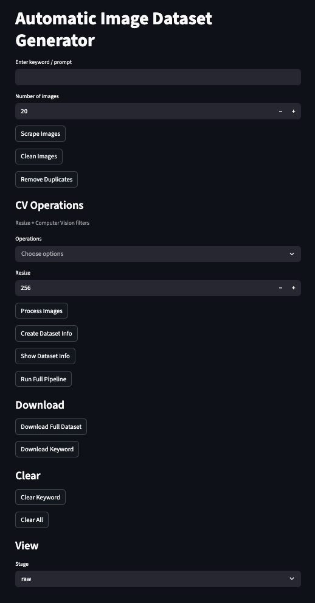
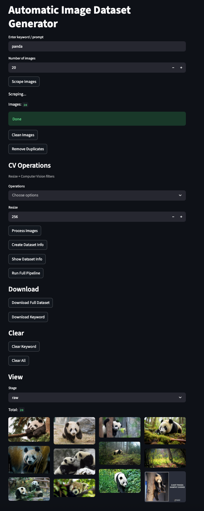
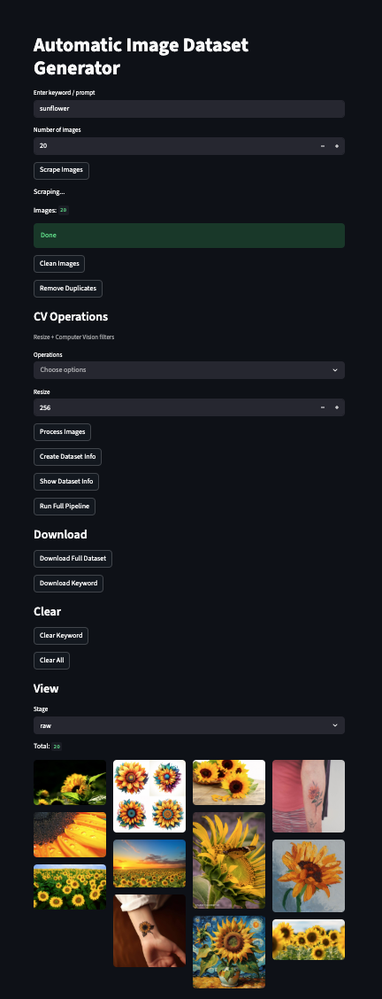
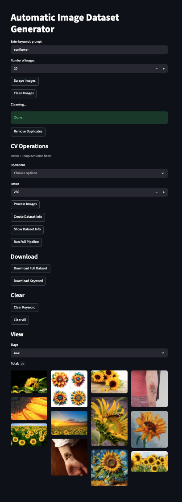
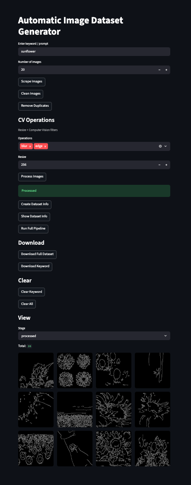
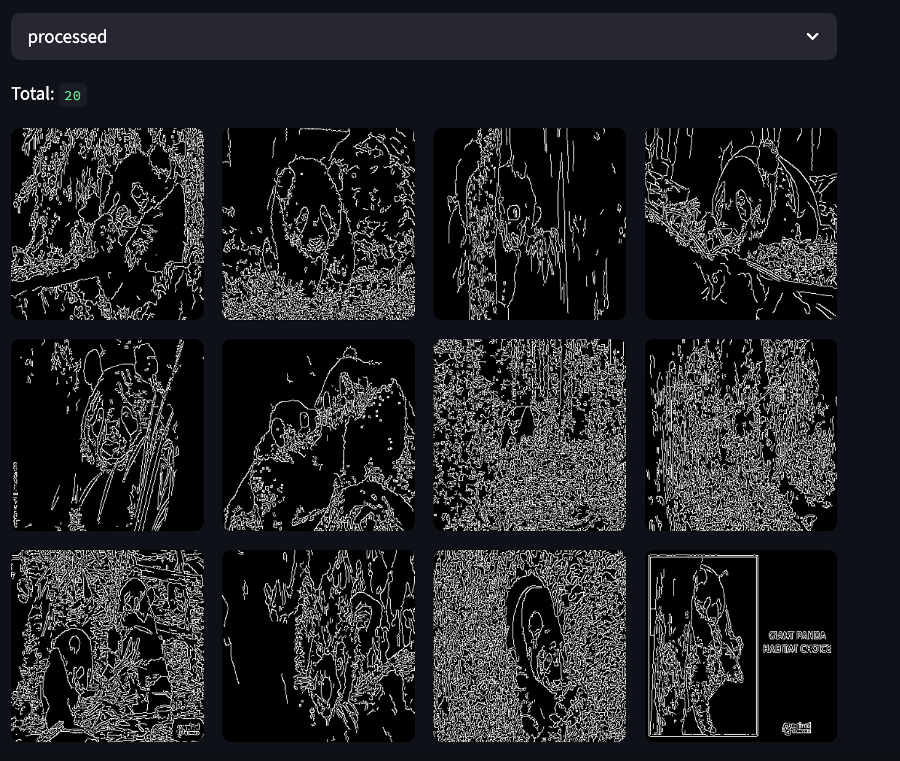
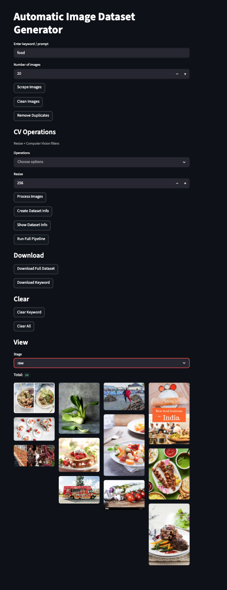
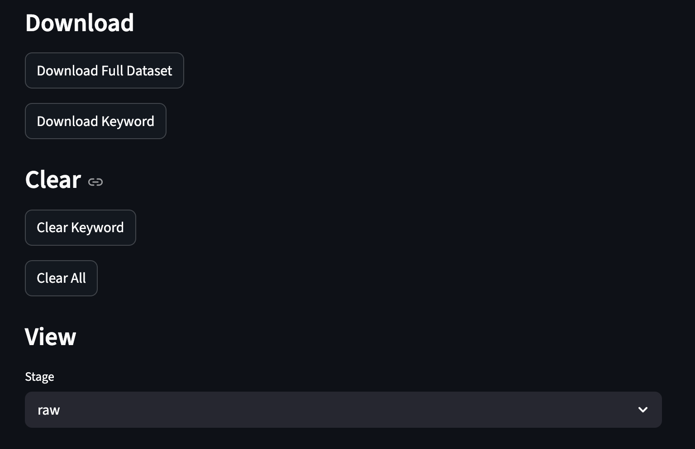

# 🚀 AutoDataset Builder – AI Dataset Generator

AutoDataset Builder is a Python-based tool that automatically creates image datasets using **web scraping + computer vision processing + automation pipeline**.

This project helps in preparing clean datasets for **Machine Learning, Deep Learning, and Computer Vision projects**.

---

## 📌 Why this project?

Machine Learning models require **large, clean, and well-structured datasets**.

Manual dataset creation is difficult because:

- Images must be collected manually
- Duplicate images exist
- Broken images exist
- Different sizes and formats
- Hard to organize folders
- Time consuming

This project automates the entire dataset creation process.

---

## ✨ Features

- 🔍 Automatic image scraping
- 🧹 Image cleaning
- ♻ Duplicate removal
- 🧠 Computer Vision processing
- 📐 Image resizing
- 📊 Dataset info generation
- 📦 ZIP export
- ⚡ Full pipeline execution
- 🖥 Streamlit GUI

---

## ⚙️ Pipeline

Scraper
↓
Cleaner
↓
Duplicate Remover
↓
Image Processor
↓
Dataset Manager
↓
ZIP Export

---

## 🔄 Workflow Diagram

User Input
↓
Image Scraper
↓
Image Cleaner
↓
Duplicate Remover
↓
CV Processing
↓
Dataset Info
↓
ZIP Export

---

## 🏗 Architecture

    ┌──────────────┐
    │  Streamlit UI │
    └──────┬───────┘
           ↓
    ┌──────────────┐
    │ Image Scraper │
    └──────┬───────┘
           ↓
    ┌──────────────┐
    │ Image Cleaner │
    └──────┬───────┘
           ↓
    ┌──────────────┐
    │ Duplicate Remover │
    └──────┬───────┘
           ↓
    ┌──────────────┐
    │ Image Processor │
    └──────┬───────┘
           ↓
    ┌──────────────┐
    │ Dataset Manager │
    └──────┬───────┘
           ↓
    ┌──────────────┐
    │ ZIP Export │
    └──────────────┘

---

## 🗂 Folder Structure

AutoDataset Builder/

scraper/
processor/
ui/

dataset/
raw/
clean/
final/
processed/

README.md
requirements.txt
.gitignore

| Folder | Purpose |
|--------|---------|
| raw | scraped images |
| clean | valid images |
| final | duplicates removed |
| processed | CV processed images |

---

## 🧠 Computer Vision Operations

The following operations can be applied:

- Resize
- Grayscale
- Blur
- Edge detection
- Threshold

Purpose:

- Uniform input for ML
- Feature extraction
- Noise removal
- Faster training

Used in Machine Learning and Computer Vision.

---

## 🧩 Project Modules

### Scraper

Downloads images from:

- Bing
- Wikimedia
- Unsplash

### Cleaner

Removes:

- broken images
- small images
- invalid files

### Duplicate Remover

Uses ImageHash to remove similar images.

### Image Processor

Uses OpenCV for filters and resizing.

### Dataset Manager

Creates dataset_info.json

### UI

Built using Streamlit.

---

## 🛠 Tech Stack

- Python
- OpenCV
- PIL
- ImageHash
- BeautifulSoup
- Requests
- Streamlit
- JSON
- Zipfile

---

## 💻 Installation

Clone repo

git clone https://github.com/AnanyaKota/auto-dataset-builder.git

Go to folder

cd auto-dataset-builder

Install dependencies

pip install -r requirements.txt

Run app

streamlit run ui/app.py

---

## 📷 Screenshots

### UI

### Image Scraping

### Raw Images

### Cleaning Stage

### CV Processing

### Processed Output

### Another Dataset Example

### Download Dataset

---

## 📊 Applications

Used for:

- Image classification
- Object detection
- Face recognition
- Medical image analysis
- OCR
- Robotics
- Autonomous vehicles
- AI research
- Kaggle datasets

---

## 🚀 Future Improvements

- Multi-class dataset input
- Video dataset support
- Cloud storage
- Better GUI
- API support
- ML integration

---

## 👩‍💻 Author

Ananya Kota  
BTech Artificial Intelligence & Machine Learning
